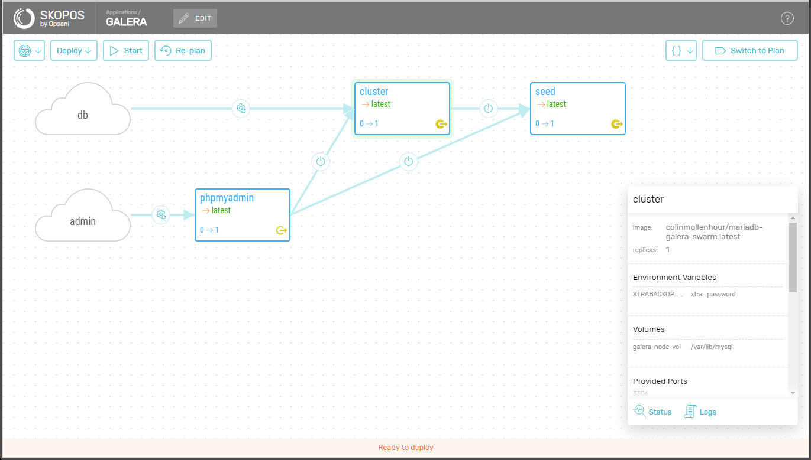

<!-- vim: set filetype=markdown: -->

## Skopos Sample MariaDB Galera Cluster for Docker Swarm

### Introduction

This is a sample application which can be used to deploy a MariaDB Galera Cluster to Docker Swarm:  this is a multi-master cluster for MariaDB which supports the XtraDB/InnoDB storage engines on Linux.  For more information please see [what is MariaDB Galera cluster](https://mariadb.com/kb/en/mariadb/what-is-mariadb-galera-cluster/).

In this sample implementation, a seed node is used to bootstrap the cluster.  It is the source of the original data with which the newly created galera nodes sync, and it is thereafter discarded.  The galera cluster seed and its nodes all use the public docker image `colinmollenhour/mariadb-galera-swarm:latest`.  Please see [this page](https://github.com/colinmollenhour/mariadb-galera-swarm) for details.

Below is a view of the sample application model with its bootstrap seed and four galera nodes:



Each galera node is constrained to run on any swarm node with a particular label.  This design provides for each galera node to be constrained to a pair of swarm nodes (hosts with a matching label), and for these pairs of swarm nodes to be laid out in a non-overlapping fashion for a given galera cluster.  The intent is to provide galera node failover in the event of a swarm node failure:  the galera node on the failed swarm node is re-started on the other swarm node of its labeled pair where it may sync its data and recover the galera cluster.

### Accessing the Galera Cluster

This sample application publishes each galera node's mariadb port (3306) on the host it is running (`PublishMode: host`), rather than publishing this port for the service using the swarm routing mesh.  Docker 17.03.0-ce suffers from docker issue [31249](https://github.com/docker/docker/issues/31249) - two services constrained to different swarm nodes cannot expose the same port using mode=host. Because of this, each of the four galera node services of this app uses a different port in the range 10000-10003.

To change this behavior and use the swarm routing mesh instead of a single host port map for each node:

* Remove or comment out from the model the separate per-node gateways section
* Uncomment the gateways section at the end of the model to expose the galera nodes on the swarm routing mesh.

### Environment Files

The application includes several environment files to be used in combination.  Skopos merges environment files in the order they are provided, so different combinations of environment files may be used to bootstrap the cluster or update the cluster in normal use (without the seed node).  The sample app includes these environment files:

* `env.yaml`:  the base environment file common to all deploys.  It defines plugins, volume names and variables.
* `env.ports.yaml`:  an environment which defines the port to be exposed for each galera node on its host.  Different copies of this file may be used to deploy multiple galera clusters to the same swarm.
* `env.bootstrap.yaml`:  an environment which simply sets the galera seed node replicas count to 1.  This file is used when bootstrapping a galera cluster.

### Usage Notes

* The seed in this sample app uses a randomly named volume on instance creation for its mariadb seed data.
* The seed, and each node, is created as its own service, and each is represented by its own skopos component.  Each of these is constrained to be placed on a swarm node matching a label.  
* Swarm node preparation:
    * Label one or more nodes of the swarm with `gseed` (e.g., `docker node update --label-add gseed=1 <node-id>`).  The seed will be created on one of the labeled nodes.
    * Divide the swarm nodes into non-overlapping pairs.  Label four of these pairs so that each pair has one of these labels: `gpair0`, `gpair1`, `gpair2`, or `gpair3` each with a value of 1.
* To bootstrap the galera cluster, deploy using all three environment files.  To remove the seed node, or upgrade the cluster, omit `env.bootstrap.yaml`.

### Quick Start Example

This is a stream-lined quick-start example.  See the [Skopos documentation](http://doc.opsani.com/skopos/edge/README/) for detailed information.

Install the `skopos` command line utility on a swarm manager node as `~/bin/skopos`:
```
wget https://s3.amazonaws.com/get-skopos/edge/linux/skopos
chmod +x skopos
mkdir -p ~/bin
mv skopos ~/bin
```

Start the Skopos engine on the same node (example binds to the default port 8100):

```
docker run -d -p 8100:8100 --restart=unless-stopped --name skopos \
   -v /var/run/docker.sock:/var/run/docker.sock \
   opsani/skopos:edge
```

Clone this repo to a working directory:
```
git clone https://github.com/opsani/skopos-sample-galera.git
```

Label the swarm nodes as described above.  Verify all swarm hosts expose the ports 10000-10003 to the outside world.

From the directory containing the application model and environment files, load the application:
```
~/bin/skopos load -project galera -env env.yaml -env env.ports.yaml -env env.bootstrap.yaml model.yaml
```

The Skopos UI, accessible on port 8100 of the manager node, now displays the model ready for its bootstrap deploy.  Once the cluster is deployed, the seed may be destroyed by deploying with:
```
~/bin/skopos load -project galera -env env.yaml -env env.ports.yaml model.yaml
```

### Verification

A quick verification:

* Docker exec into and run the mysql client on one of the galera nodes:  `docker exec -ti <id> mysql -u root -p`.  Provide the password `asdf` from the env file.
* Create a user with remote access permissions (*not secure*):
    * `CREATE USER 'qwer'@'%' IDENTIFIED BY 'qwer';`
    * `GRANT ALL ON *.* TO 'qwer'@'%';`
* From a remote host with the mysql client installed, access one of the galera nodes:  `mysql -u qwer --host <ip> --port <port> -p`  Provide the password `qwer`.
* Verify the galera cluster syncs:  create a database on one node and verify this change propagates to all nodes.